# 🏏 Cricket Stats LLM

A comprehensive cricket statistics application that combines web search, LLM-powered code generation, and data visualization to provide detailed cricket player statistics and charts.

## 🌟 Features

- **Smart Search**: Searches the web for comprehensive cricket statistics
- **AI-Powered Analysis**: Uses LLMs to generate custom visualization code
- **Interactive Charts**: Creates professional bar charts showing player performance
- **Multi-Format Support**: Covers Test, ODI, and T20I cricket formats

## 🏗️ Architecture

### System Overview

```mermaid
graph TB
    %% User Interface Layer
    User[👤 User] --> Frontend[🎨 Streamlit Frontend<br/>Port: 8501]
    
    %% API Communication
    Frontend -->|HTTP Request<br/>player_name| Backend[⚡ FastAPI Backend<br/>Port: 8000]
    Backend -->|JSON Response<br/>stats + chart_path| Frontend
    
    %% Backend Components
    Backend --> SearchModule[🔍 Direct Search Module<br/>direct_search.py]
    Backend --> CodeGenModule[🤖 Code Generation Module<br/>coding_gen_test.py]
    
    %% External APIs
    SearchModule -->|Advanced Query| TavilyAPI[🌐 Tavily Search API<br/>Web Search + Context]
    TavilyAPI -->|Cricket Statistics<br/>JSON Data| SearchModule
    
    %% LLM Integration
    CodeGenModule --> AutoGenAgent[🧠 AutoGen Agents<br/>Multi-Agent System]
    AutoGenAgent --> OpenAIAPI[🚀 OpenAI GPT-4<br/>Code Generation]
    AutoGenAgent --> LocalLLM[🏠 Local LLM<br/>LM Studio<br/>Optional]
    
    %% Docker Environment
    AutoGenAgent -->|Generated Code| DockerExec[🐳 Docker Executor<br/>python:3.10 Image]
    DockerExec -->|Install Dependencies| PythonEnv[📦 Python Environment<br/>matplotlib, pandas]
    PythonEnv -->|Execute Code| ChartGen[📊 Chart Generation<br/>cricket_stats_chart.png]
    
    %% File System
    ChartGen --> FileSystem[💾 File System<br/>./docker_tmp/]
    FileSystem -->|Chart File Path| Backend
    Frontend -->|Display Chart| FileSystem
    
    %% Configuration
    ConfigFiles[⚙️ Configuration<br/>.env file] --> Backend
    ConfigFiles --> SearchModule
    ConfigFiles --> CodeGenModule
    
    %% Data Flow Annotations
    SearchModule -.->|1. Search Query| TavilyAPI
    TavilyAPI -.->|2. Raw Data| SearchModule
    SearchModule -.->|3. Parsed Stats| Backend
    Backend -.->|4. Stats Data| CodeGenModule
    CodeGenModule -.->|5. AI Prompt| AutoGenAgent
    AutoGenAgent -.->|6. Python Code| DockerExec
    DockerExec -.->|7. Generated Chart| FileSystem
    FileSystem -.->|8. Chart Path| Frontend
    
    %% Styling
    classDef frontend fill:#e1f5fe,stroke:#01579b,stroke-width:2px
    classDef backend fill:#f3e5f5,stroke:#4a148c,stroke-width:2px
    classDef ai fill:#fff3e0,stroke:#e65100,stroke-width:2px
    classDef external fill:#e8f5e8,stroke:#2e7d32,stroke-width:2px
    classDef docker fill:#e3f2fd,stroke:#0277bd,stroke-width:2px
    classDef config fill:#fce4ec,stroke:#880e4f,stroke-width:2px
    
    class Frontend frontend
    class Backend,SearchModule,CodeGenModule backend
    class AutoGenAgent,OpenAIAPI,LocalLLM ai
    class TavilyAPI external
    class DockerExec,PythonEnv,ChartGen docker
    class ConfigFiles,FileSystem config
```


### Technical Flow

```mermaid
sequenceDiagram
    participant U as 👤 User
    participant SF as 🎨 Streamlit Frontend
    participant FA as ⚡ FastAPI Backend
    participant DS as 🔍 Direct Search
    participant TA as 🌐 Tavily API
    participant CG as 🤖 Code Generator
    participant AG as 🧠 AutoGen Agent
    participant AI as 🚀 OpenAI/Local LLM
    participant DE as 🐳 Docker Executor
    participant FS as 💾 File System

    U->>SF: Enter "Virat Kohli"
    SF->>FA: GET /get_stats?player_name=Virat Kohli
    
    Note over FA: Initialize search and processing
    FA->>DS: direct_web_search("Virat Kohli")
    DS->>TA: Advanced query: "Virat Kohli cricket career statistics Test ODI T20I matches runs average centuries in json format"
    TA-->>DS: Raw cricket statistics (JSON/Text)
    DS->>DS: compact_search_results()<br/>Parse and format data
    DS-->>FA: Structured cricket stats

    Note over FA: Initialize AI code generation
    FA->>CG: CodeGen(summary)
    CG->>AG: UserProxyAgent + AssistantAgent setup
    AG->>AI: System prompt: "Create cricket visualization charts"
    AI-->>AG: Generated Python code:<br/>- matplotlib setup<br/>- data parsing<br/>- 2x2 subplot creation
    
    Note over AG,DE: Code execution in isolated environment
    AG->>DE: Execute bash: "pip install matplotlib"
    DE-->>AG: Dependencies installed
    AG->>DE: Execute Python code
    DE->>DE: Parse JSON statistics<br/>Extract Test/ODI/T20I data
    DE->>DE: Create 2x2 bar charts<br/>Add value labels<br/>Format professionally
    DE->>FS: Save "cricket_stats_chart.png"
    FS-->>DE: File saved successfully
    DE-->>AG: Execution completed
    AG-->>CG: Chart generation finished
    CG-->>FA: Process completed

    Note over FA: Verify and respond
    FA->>FS: Check chart file existence
    FS-->>FA: Chart path confirmed
    FA-->>SF: JSON response:<br/>{execution_completed: true,<br/>chart_generated: true,<br/>statistics: {...}}

    Note over SF: Display results
    SF->>SF: Display statistics text
    SF->>FS: Read cricket_stats_chart.png
    FS-->>SF: Chart image data
    SF->>U: Show statistics + chart<br/>+ download button
```


### Tech Stack Layers

```mermaid
graph LR
    subgraph "🎨 Presentation Layer"
        ST[Streamlit UI<br/>• Interactive Components<br/>• File Upload/Download<br/>• Real-time Updates<br/>• Error Handling]
    end
    
    subgraph "⚡ API Gateway Layer"
        FA[FastAPI Backend<br/>• Async Endpoints<br/>• Auto OpenAPI Docs<br/>• Request Validation<br/>• CORS Support]
    end
    
    subgraph "🧠 Business Logic Layer"
        DS[Search Service<br/>• Web Search Integration<br/>• Data Parsing<br/>• Result Compaction]
        CG[Code Generation Service<br/>• LLM Integration<br/>• Agent Orchestration<br/>• Prompt Engineering]
    end
    
    subgraph "🌐 External APIs"
        TV[Tavily Search API<br/>• Advanced Web Search<br/>• Context Extraction<br/>• JSON Responses]
        OA[OpenAI API<br/>• GPT-4 Integration<br/>• Code Generation<br/>• Intelligent Reasoning]
        LS[LM Studio<br/>• Local LLM Support<br/>• Cost Optimization<br/>• Privacy Control]
    end
    
    subgraph "🤖 AI Processing Layer"
        AG[AutoGen Agents<br/>• Multi-Agent System<br/>• Conversation Flow<br/>• Role Specialization]
        UP[User Proxy Agent<br/>• Code Execution<br/>• Human Simulation<br/>• Termination Control]
        AA[Assistant Agent<br/>• Code Writing<br/>• Problem Solving<br/>• Context Management]
    end
    
    subgraph "🐳 Execution Environment"
        DE[Docker Executor<br/>• Isolated Environment<br/>• python:3.10 Image<br/>• Package Management]
        PY[Python Runtime<br/>• matplotlib<br/>• pandas<br/>• numpy]
    end
    
    subgraph "💾 Data Layer"
        FS[File System<br/>• Chart Storage<br/>• Temp Files<br/>• Cross-platform Paths]
        CF[Configuration<br/>• Environment Variables<br/>• API Keys<br/>• Settings]
    end
    
    %% Connections
    ST --> FA
    FA --> DS
    FA --> CG
    DS --> TV
    CG --> AG
    AG --> UP
    AG --> AA
    AA --> OA
    AA --> LS
    UP --> DE
    DE --> PY
    PY --> FS
    CF --> FA
    CF --> DS
    CF --> CG
    
    %% Styling
    classDef presentation fill:#e1f5fe,stroke:#01579b,stroke-width:2px
    classDef api fill:#f3e5f5,stroke:#4a148c,stroke-width:2px
    classDef business fill:#fff3e0,stroke:#e65100,stroke-width:2px
    classDef external fill:#e8f5e8,stroke:#2e7d32,stroke-width:2px
    classDef ai fill:#fff8e1,stroke:#ff8f00,stroke-width:2px
    classDef execution fill:#e3f2fd,stroke:#0277bd,stroke-width:2px
    classDef data fill:#fce4ec,stroke:#880e4f,stroke-width:2px
    
    class ST presentation
    class FA api
    class DS,CG business
    class TV,OA,LS external
    class AG,UP,AA ai
    class DE,PY execution
    class FS,CF data
```


### Directory Structure
```
cricket-agent-analytics/
├── backend/           # FastAPI backend service
│   ├── main.py       # Main API endpoints
│   ├── direct_search.py    # Web search functionality  
│   ├── coding_gen_test.py  # LLM code generation
│   └── docker_tmp/   # Generated charts and temp files
└── frontend/         # Streamlit frontend
    └── app.py       # Main UI application
```

## 🚀 Quick Start

### Prerequisites

- Python 3.10+
- Docker Desktop (for chart generation)
- OpenAI API key
- Tavily API key (for web search)

### Installation

1. **Clone the repository**
   ```bash
   git clone <your-repo-url>
   cd cric_stats_llm
   ```

2. **Create virtual environment**
   ```bash
   python -m venv venv
   source venv/bin/activate  # On Windows: venv\Scripts\activate
   ```

3. **Install dependencies**
   ```bash
   pip install -r requirements.txt
   ```

4. **Configure environment**
   ```bash
   cp .env.example .env
   # Edit .env with your actual API keys
   ```

### Running the Application

1. **Start the backend**
   ```bash
   cd backend
   uvicorn main:app --reload --port 8000
   ```

2. **Start the frontend** (in a new terminal)
   ```bash
   cd frontend
   streamlit run app.py --server.port 8501
   ```

3. **Access the application**
   - Frontend: http://localhost:8501
   - Backend API: http://localhost:8000
   - API Docs: http://localhost:8000/docs

## 🎯 Usage

1. **Enter Player Name**: Type any cricket player's name (e.g., "Virat Kohli")
2. **Generate Stats**: Click "Get Stats" to search and analyze
3. **View Results**: See comprehensive statistics and visual charts
4. **Download Charts**: Save generated charts as PNG files

## 🔧 Configuration

### API Keys Required

- **OpenAI API**: For LLM-powered code generation
- **Tavily API**: For advanced web search capabilities

### Optional: Local LLM Setup

The application supports local LLM models via LM Studio:

1. Install [LM Studio](https://lmstudio.ai/)
2. Load models like `mistral-7b-instruct` or `deepseek-coder-6.7b`
3. Start local server on port 1234
4. Update `.env` with local model configurations

## 📊 Supported Statistics

- **Match Statistics**: Games played across all formats
- **Batting Records**: Runs scored, batting averages
- **Career Milestones**: Centuries, half-centuries
- **Format Breakdown**: Test, ODI, T20I separate analysis

## 🐛 Troubleshooting

### Common Issues

**Backend Connection Error**
```
❌ Cannot connect to backend server
```
- Ensure backend is running on port 8000
- Check firewall settings

**Chart Generation Failed**
```
⚠️ Chart was generated but could not be found
```
- Ensure Docker is running
- Check file permissions in `docker_tmp/` directory

**API Key Errors**
- Verify API keys in `.env` file
- Check API key validity and quotas

## 🛠️ Development

### Project Structure
- `backend/main.py`: FastAPI endpoints and main logic
- `backend/direct_search.py`: Web search and data parsing
- `backend/coding_gen_test.py`: LLM-based code generation
- `frontend/app.py`: Streamlit user interface

### Adding New Features
1. Backend endpoints in `main.py`
2. Search enhancements in `direct_search.py`
3. Chart modifications in the LLM prompts
4. UI improvements in `app.py`


---

**Built with**: FastAPI • Streamlit • AutoGen • OpenAI • Tavily • Docker 
